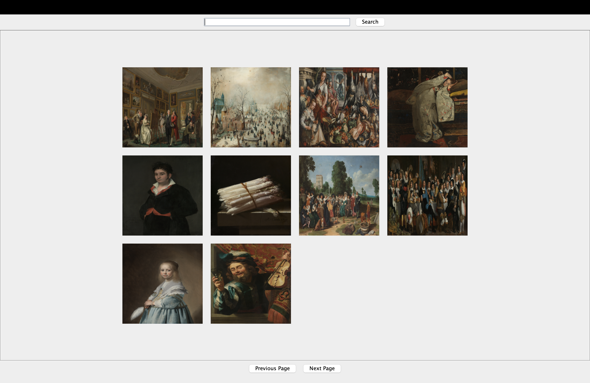

#Title Rijksmuseum Artist Search"

This project implements a RijksService with three API methods to fetch art collections from the Rijksmuseum, supporting
requests by page number, query, and artist. It includes a graphical interface (RijksSearchFrame) that allows users to
search, display results with tooltips, and navigate through pages of artworks, showing 10 results at a time.